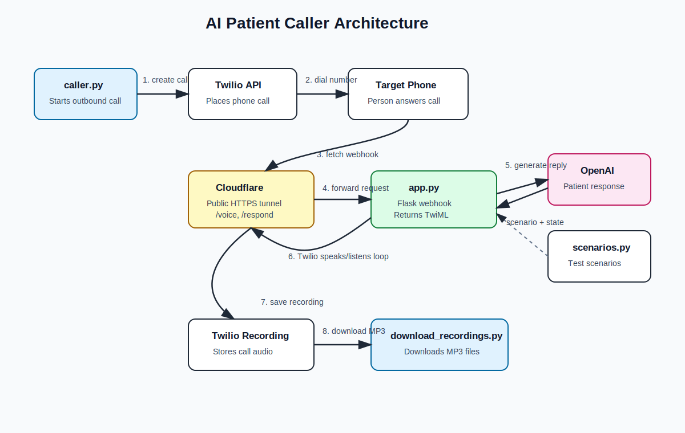

# AI Patient Caller

AI Patient Caller is a Twilio, Flask, Cloudflare Tunnel, and OpenAI based voice bot that tests how a medical office phone agent handles realistic patient conversations.

The bot calls a target phone number, listens to the agent, responds as a patient using predefined scenarios, records the call, and downloads the recording for review.

## Architecture



## Project Flow

1. `caller.py` starts an outbound phone call using Twilio.
2. Twilio calls the target phone number.
3. When the person answers, Twilio requests instructions from the Flask webhook.
4. Cloudflare Tunnel forwards the public webhook request to the local Flask app.
5. `app.py` returns TwiML instructions so Twilio can speak and listen.
6. Twilio sends captured speech to `/respond`.
7. Flask sends the speech, scenario, and conversation history to OpenAI.
8. OpenAI returns the patient reply.
9. Twilio speaks the reply and continues the conversation.
10. Twilio records the call.
11. `download_recordings.py` downloads the MP3 recording.

## Files

| File | Purpose |
|---|---|
| `app.py` | Main Flask server. Handles Twilio webhooks, speech input, OpenAI replies, and conversation state. |
| `caller.py` | Starts an outbound call using the Twilio REST API. |
| `scenarios.py` | Stores patient test scenarios and bug cases. |
| `download_recordings.py` | Downloads Twilio call recordings as MP3 files. |
| `.env` | Stores API keys, phone numbers, and public tunnel URL. |
| `architecture_diagram.svg` | Visual architecture diagram. |
| `PROJECT_ARCHITECTURE.md` | Short architecture explanation. |

## Requirements

- Python 3.10 or newer
- Twilio account with a phone number
- OpenAI API key
- Cloudflare Tunnel or another public tunnel
- Flask
- Twilio Python SDK
- OpenAI Python SDK
- python-dotenv
- requests

Install dependencies:

```cmd
pip install -r requirements.txt
```

If `requirements.txt` is missing, install manually:

```cmd
pip install flask twilio openai python-dotenv requests
```

## Environment Variables

Create a `.env` file in the project root:

```env
OPENAI_API_KEY=your_openai_api_key
TWILIO_ACCOUNT_SID=your_twilio_account_sid
TWILIO_AUTH_TOKEN=your_twilio_auth_token
TWILIO_PHONE_NUMBER=+1xxxxxxxxxx
TARGET_PHONE_NUMBER=+1xxxxxxxxxx
PUBLIC_BASE_URL=https://your-url.trycloudflare.com
```

Important:

```env
PUBLIC_BASE_URL=https://your-url.trycloudflare.com
```

Do not include `/voice` in `PUBLIC_BASE_URL`.

Correct:

```env
PUBLIC_BASE_URL=https://your-url.trycloudflare.com
```

Wrong:

```env
PUBLIC_BASE_URL=https://your-url.trycloudflare.com/voice
```

## How To Run

### 1. Start Flask

In terminal 1:

```cmd
python app.py
```

The app should run on:

```text
http://127.0.0.1:5000
```

Test locally:

```text
http://127.0.0.1:5000/voice
```

You should see TwiML XML.

### 2. Start Cloudflare Tunnel

In terminal 2:

```cmd
cloudflared tunnel --url http://localhost:5000 --protocol http2
```

Cloudflare will give a public URL like:

```text
https://example.trycloudflare.com
```

Update `.env`:

```env
PUBLIC_BASE_URL=https://example.trycloudflare.com
```
Update `app.py`:

```env
PUBLIC_BASE_URL=https://example.trycloudflare.com
```

Restart Flask after changing `.env`.

### 3. Configure Twilio Webhook

In Twilio Console, set the Voice webhook to:

```text
https://example.trycloudflare.com/voice
```

Method:

```text
HTTP POST
```

### 4. Start An Outbound Call

Run:

```cmd
python caller.py
```

Twilio will call the target number and use the `/voice` webhook for instructions.

### 5. Download Recordings

After the call ends, run:

```cmd
python download_recordings.py
```

Recordings should download into a local recordings folder.

## Scenario Selection

Scenarios are stored in `scenarios.py`.

To run a specific scenario, add `scenario_id` to the webhook URL:

```text
https://example.trycloudflare.com/voice?scenario_id=ambiguous_date_friday
```

Example scenario:

```python
{
    "id": "ambiguous_date_friday",
    "patient": "John Smith",
    "dob": "June 15, 1985",
    "goal": "Ask for next Friday, then correct it to this Friday.",
    "bug_tested": "Ambiguous date handling",
    "expected_agent_behavior": "Agent should confirm the exact calendar date.",
    "failure_signal": "Agent books without clarifying the date.",
}
```

## Current Guardrails

The app includes deterministic handling for common bugs:

- Wrong DOB but agent says to proceed.
- No appointments available today.
- Appointment already booked.
- Name and DOB consistency.
- Scenario specific conversation state.

These guardrails run before OpenAI to reduce hallucination and repeated incorrect replies.

## Troubleshooting

If Twilio does not reach Flask, check the Flask terminal.

Browser test shows:

```text
GET /voice 200
```

Twilio call should show:

```text
POST /voice 200
POST /respond 200
```

If you only see browser `GET` requests, Twilio is not using the current webhook URL.

If Cloudflare is unstable, restart it with:

```cmd
cloudflared tunnel --url http://localhost:5000 --protocol http2
```

If the bot gives bad replies, check the Flask logs:

```text
Agent speech: ...
Speech confidence: ...
```

This shows what Twilio actually heard.


